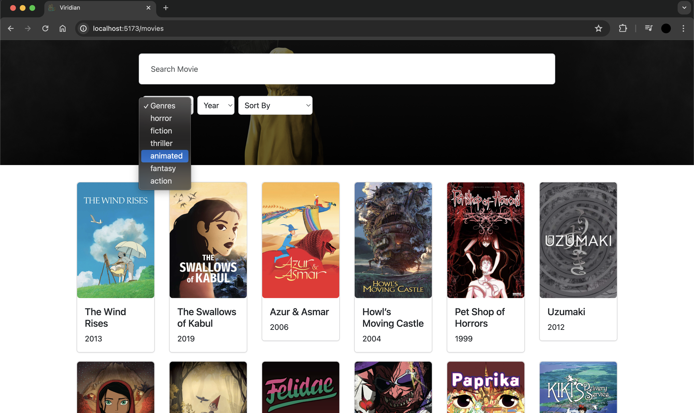
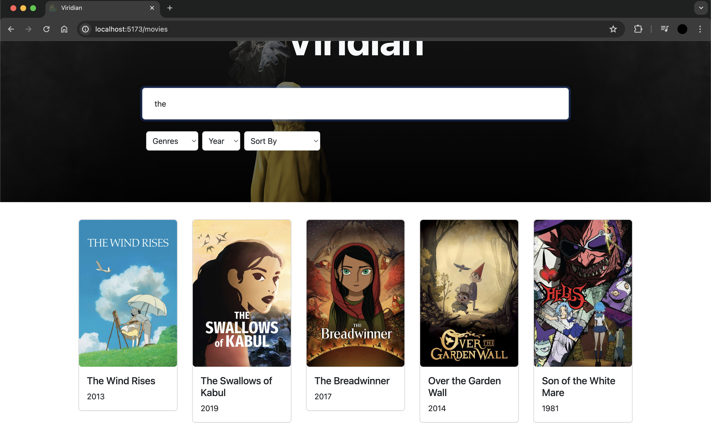
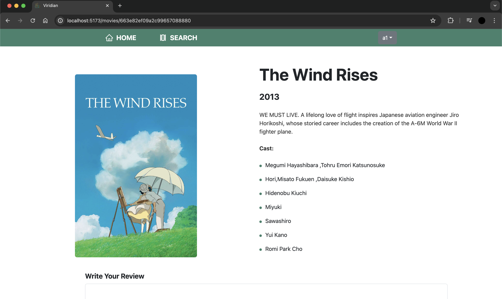
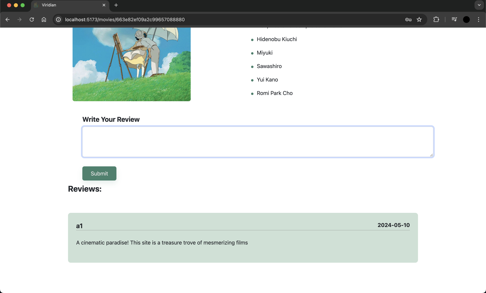
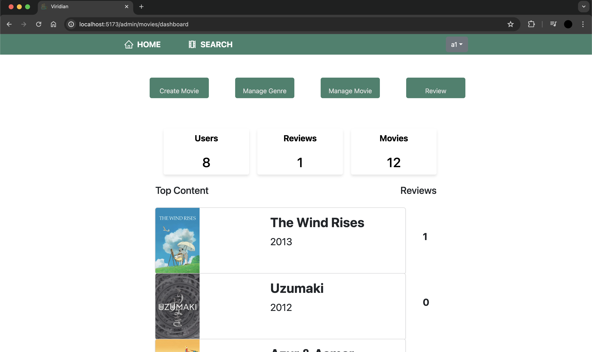
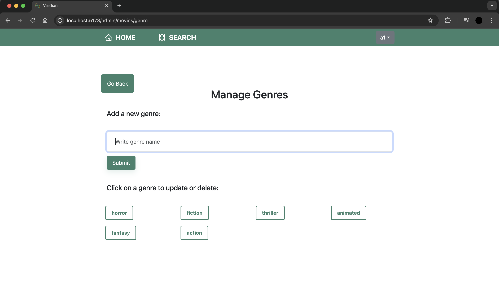
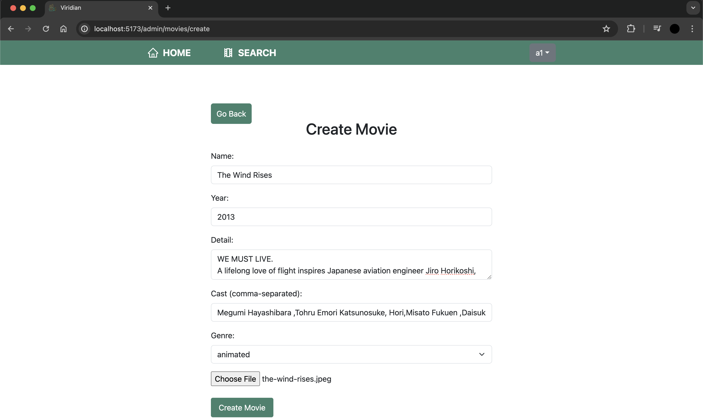

# Viridian

Social cataloging application: where users log watched films, rate and review them, create personalized lists, and contribute to a community-centric environment. It additionally features a watchlist for planning future viewings, detailed film information, and customizable profiles.

## Features

### Admin:

- **Genre Management**: Create, Read, Update, and Delete (CRUD) genres.
- **Movie Management**: CRUD operations for movies.
- **Dashboard Insights**: View reviews, total number of users, and top-rated movies.

### User:

- **Review Submission**: Users can add reviews for movies.
- **Search Functionality**: Search for movies and sort results by new, random, or top content.
- **Advanced Search**: Filter movies by genre and year.
- **Profile Management**: Users can update their profile information including password, name, and email.

## Technologies Used

- MongoDB
- Express.js
- React
- Node.js

## Screenshots

### Landing Page

### Search

### Movie Details

### Reviews

### Admin Dashboard

